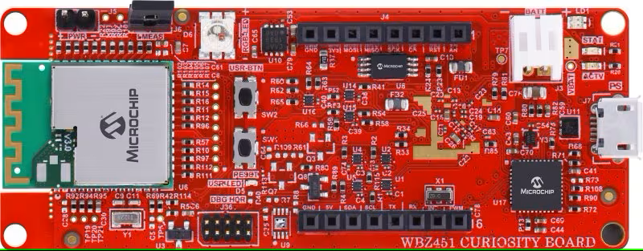
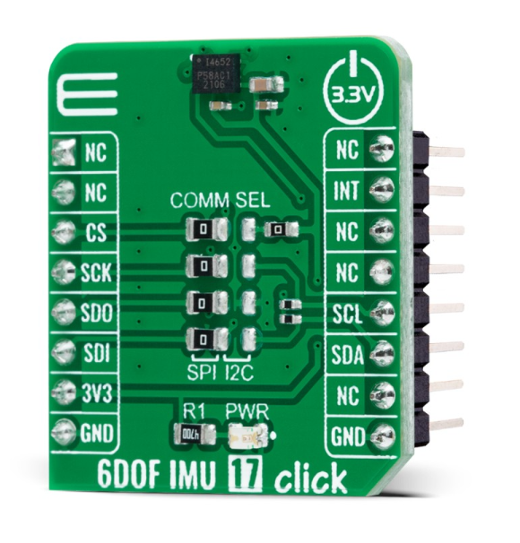
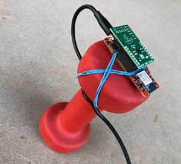
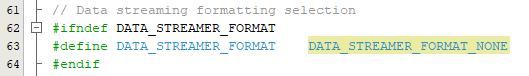
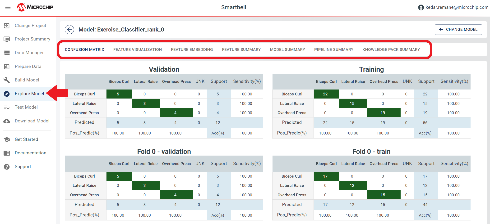

   
# ml-PIC33CX-BZ2-and-WBZ451-IMU-SmartBell

|  |
| :----------------------------------------------------------: |
|                        |

## Repository Overview
This repository is a companion to the [ML applications with MPLAB ML tutorial](https://onlinedocs.microchip.com/oxy/GUID-80D4088D-19D0-41E9-BE8D-7AE3BE021BBF-en-US-3/GUID-E6CBB10A-FFC8-4EF3-8C07-D29B64446EB6.html). It contains the firmware to Transform your conventional dumbbell into an intelligent training device utilizing the PIC32CX-BZ2 / WBZ451 Machine Learning Evaluation Kit in conjunction with the MPLAB X Machine Learning Development Suite on [PIC33CX-BZ2 and WBZ451 Curiosity Development Board](https://www.microchip.com/en-us/development-tool/ev96b94a) with the [Mikroe IMU Click board](https://www.mikroe.com/6dof-imu-2-click)

The ML Development Suite streamlines the development of machine learning solutions specifically tailored for application and deployment on Microchip’s microcontrollers and microprocessors. This manual offers a comprehensive walkthrough, demonstrating the steps to gather 6-axis IMU data from the PIC32CX-BZ2 / WBZ451 Machine Learning Evaluation Kit( the logger firmware can be found on the latest GitHub [ml-PIC33CX-BZ2-and-WBZ451-IMU-Datalogger](https://github.com/MicrochipTech/ml-PIC33CX-BZ2-and-WBZ451-IMU-Datalogger?tab=readme-ov-file)
repo), transmit the acquired data to the ML Model Builder, construct a personalized model capable of accurately classifying the input data, and ultimately deploy the model onto the Machine Learning Evaluation Kit.   

## Hardware Used
 * |  |
   | :--: |
   | *[PIC32CX-BZ2 and WBZ451 Curiosity Development Board](https://www.microchip.com/en-us/development-tool/ev96b94a)* |

 * |  |
   | :--: |
   | *[Mikroe 6DOF IMU 17 CLICK](https://www.microchip.com/en-us/development-tool/ev96b94a)* |

 * |  |
   | :--: |
   | *Mounting Putty* |

 * |  |
   | :--: |
   | *Dumbbell* |  
  

## Software Used
* [MPLAB® X IDE](https://microchip.com/mplab/mplab-x-ide)
* [MPLAB® XC32 Compiler](https://microchip.com/mplab/compilers)
* [MPLAB® Code Configurator](https://www.microchip.com/en-us/tools-resources/configure/mplab-code-configurator)
* [MPLAB® ML Model Builder](https://onlinedocs.microchip.com/v2/keyword-lookup?keyword=MPLAB-ML-Documentation&redirect=true)

## Setup
The kit is mounted on one end of the dumbbell using double-sided sticky tape and rubber bands. The USB cable is tied around the handle to prevent the kit from being pulled off.
  |  |
  | :--: |
  | *Smartbell setup* |  

## Data Collection
The initial phase of constructing a machine-learning model involves the acquisition of data. This dataset serves as the foundation for training the ML model, enabling it to discern various types of exercises. In this particular instance, the model will be trained to identify three distinct exercises.
             
## Data Collection Firmware
A binary build of the data logging firmware used in the data collection for this project can be found in the [binaries folder of this repo](/binaries); to build data logging firmware for different  configurations, visit the [ml-PIC33CX-BZ2 and WBZ451 data logger]([https://github.com/MicrochipTech/ml-dsPIC33CK-LVMC-Data-Logger](https://github.com/MicrochipTech/ml-PIC33CX-BZ2-and-WBZ451-IMU-Datalogger)) repository.
In this section, the recommended approach for gathering data samples to build the exercise classifier model is discussed.
To begin the data collection process, it is essential to identify a suitable sensor configuration for your specific application. This will involve determining the optimal placement of the sensor, selecting an appropriate installation method, and configuring the signal processing parameters, such as the sample rate and sensitivity.

## Sensor Installation
To attach the PIC32CX-BZ2 board to the Dumbbell, a standard mounting putty was utilized, which is commonly used for mounting lightweight objects like posters onto walls. The board was placed in its default orientation, where the accelerometer reads X=0, Y=0, Z=1g. The placement was chosen for its ease of installation and no particular reason.
Sensor Sampling Configuration
The sensor sampling parameters are summarized below:
•	Sensor: 3-axis Accelerometer + 3-axis Gyrometer
•	Sample Rate / Frequency Range: 100 Hz (~40 Hz 3 dB cutoff)
•	Accelerometer Full Scale Range: +/-2G (most sensitive setting)
•	Gyrometer Full Scale Range: +/-125 DPS (most sensitive setting)
Keep in mind that the configuration above was derived from analysis on a specific Dumbbell, so it may not be optimal for different setups.

## Data Collection Protocol
To proceed with the data collection process, the next essential step involves creating a protocol that outlines the necessary procedures for collecting data. This entails determining the number of samples to be collected, the metadata parameters to be captured and other relevant parameters that will govern the data collection procedure. The protocol will serve as a guide for executing the data collection process and ensure that the data collected is consistent and accurate.

## Data Collection: Metadata
Initially, it is imperative to address metadata, as it significantly contributes to contextualizing our data. In this application, our metadata comprises solely the dataset, which is partitioned into training and testing subsets.

## Data Collection: Sampling Method
At this stage, it is necessary to decide the data sampling process for our application. This involves determining the number of samples to be collected and defining the necessary steps for measuring the data. In the context of this example application, the methodology can be summarized in the following steps:
•	Record and label segments for each of the following Exercises settings: overhead press, Biceps curl and lateral raises.
How to Configure, Compile and Flash
This document explains the steps involved in configuring the data logger firmware build, compiling it and flashing it to the PIC32CX-BZ2 device. Follow the instructions below:
1.	Connect the Curiosity Nano board to your PC using a USB cable.
2.	Install the MPLAB X IDE and XC32 compiler on your PC. These are essential tools for loading the data logger project and programming the PIC32CX-BZ2 board.
3.	Open the firmware/avr128da48_cnano_imu.X project folder in MPLAB X.
4.	Choose the appropriate MPLAB X Project Configuration for your sensor based on the table provided below.
Select the data streaming format you want by setting the DATA_STREAMER_FORMAT macro in firmware/src/app_config.h to the appropriate value as summarized in the table below.
Figure 1-18. Selecting the type of data streamer format.
 
1.	Modify high level sensor parameters like sample rate (SNSR_SAMPLE_RATE), accelerometer range (SNSR_ACCEL_RANGE) and others by changing the macro values defined in firmware/src/app_config.h. See the inline comments for further details.
When you are satisfied with your configuration, click the Make and Program Device icon button in the toolbar (see image below for reference).
Figure 1-19. Programming the device
 

## Firmware Operation

The behavior of the firmware can be summarized as operating in one of the distinct states described in the table below.

| UART Terminal output           | Description                                                        |
| ------------------------------ |  ------------------------------------------------------------ |
| Idle                           | The dumbbell is stationary                                   |
| Bicep curl                     | The user is performing the Bicep curl exercise using the smartbell         |
| overhead Press                 | The user is performing a Shoulder press exercise using the smartbell       |
| Lateral Raise                  | The user is performing a lateral raise exercise using the smartbell   |
| ERROR                          | The Model is not able to classify the project correctly |

## Running the application Demo

- Start MPLAB X IDE and open the project `wbz451-smartbell-lib/ml-wbz451-imu-smartbell-lib.X` with device selection dsPIC33CK256MP508.

- Set the project `ml-wbz451-imu-smartbell-lib.X` as the main project.

- Open the `app_config.h` file located under Header Files. 

- Ensure that the macro **`DATA_STREAMER_FORMAT`** is set as **`DATA_STREAMER_FORMAT_NONE`**

​                               
                       

 

- Open project properties and ensure that the selected MPLAB® XC32 Compiler and Device Pack support the device configured in the firmware. 

- Build the project and program the device. 

- Open the terminal window on Data Visualizer, select the COM port of the LVMC board, and set the below configurations
  - Baud rate 115200
  - Data bits 8
  - Stop bits 1
  - Parity None

## Classifier Performance
Below is the confusion matrix for the test dataset. Note that the classes are highly imbalanced so accuracy is not a good indicator of overall performance.

